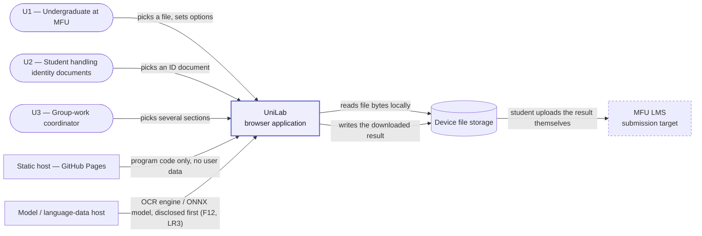
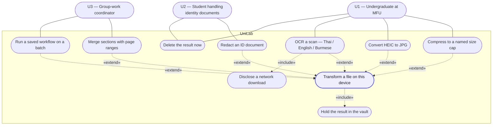
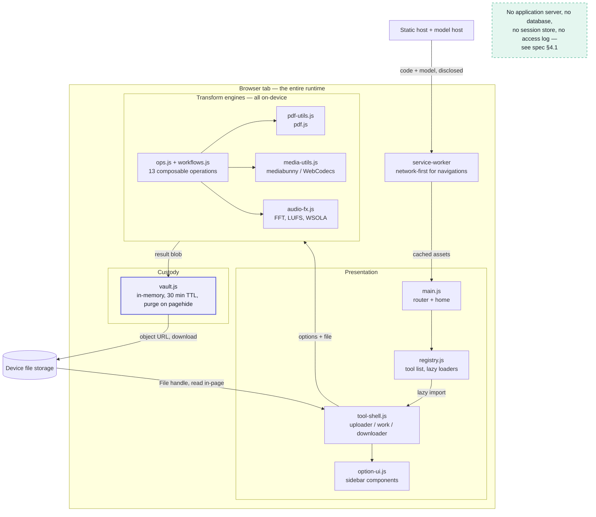
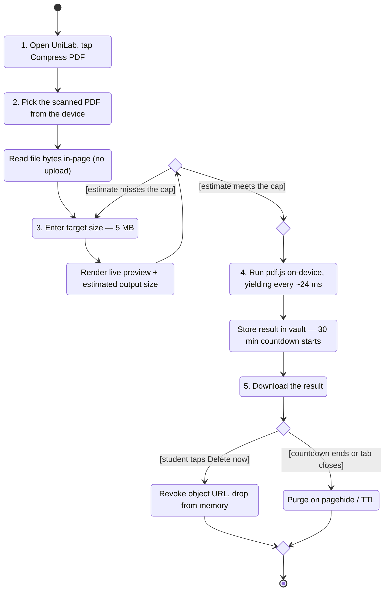

# Diagrams D1–D4 — UniLab

**Course:** 1305493 · W4 · 2 Sep 2026
**Source:** Mermaid, rendered natively by GitHub. The `.md` **is** the source file — there is no
separate binary to fall out of date with the spec.
**Checked by:** [`.claude/agents/diagram-checker.md`](../../.claude/agents/diagram-checker.md)

Every actor name below appears in spec §1.1. Every step in D4 appears in
[`user-journey.md`](user-journey.md), in the same order. The architecture in D3 names only
components that exist in `src/`.

---

## D1 · System Context

The system as one box: who talks to it, and what crosses the boundary.

**What this diagram is claiming.** There is **no arrow carrying user file content out of the
box**. The only inbound arrows are program code and model data. Submission to the LMS is drawn
dashed and *outside* the system: the student does it themselves, from their own device, after
UniLab is finished. That absence is LR1, and it is why §4.1 of the spec can dissolve the CCA §26
logging duty — there is no event to log.

**In scope:** the transform. **Out of scope:** submission, storage, accounts, delivery.

---

## D2 · Use Case

Who can do what. The core use case is central; every other use case is a parameterisation of it.

**Reading the notation.** Plain solid lines join an actor to a use case. Dashed arrows are
UML stereotypes.

- **`«include»` is used twice, and only where it is genuinely unconditional.** Every transform
  *always* puts its result in the vault (F6/LR5), so `UC1 «include» UC8`. OCR *always* fetches a
  language pack before it can run, so it must always disclose (F12/LR3).
- **`«extend»` carries the rubric argument.** The specific tools extend the core use case rather
  than sitting beside it — that is the diagram-level statement of "58 settings of one workflow".
- U1 and U2 are the **same person at a different moment** (spec §1.1). Both are drawn because
  the custody stakes differ: a lecture handout and a passport scan are not the same risk.

---

## D3 · High-level Architecture

Components and the direction data moves. Matches the stack named in the spec: Vite + vanilla JS,
pdf.js, mediabunny/WebCodecs, ONNX Runtime Web, Tesseract.

**The tier that is not here is the design.** Every box sits inside one browser tab. There is no
API tier and no database tier, so there is nowhere for an `access_log` table or a `consent`
store to live — which is exactly why the duties in spec §4.1 dissolve rather than being
discharged. The one boundary crossing, `CDN → service worker`, carries program code and model
data only.

**Where the known defect lives:** the `CDN → service worker` precache is **31 MB**, 23 MB of it
the ONNX runtime for a single tool (D1 in the spec, B9). It is a defect of this architecture,
drawn here rather than hidden.

---

## D4 · Activity

One scenario, start to end: **compress a scanned PDF to the 5 MB cap** — the five steps of
[`user-journey.md`](user-journey.md), in order.

**Notation.** `[*]` renders as the UML initial node (●) and the final node (◉) — no labelled
"Start"/"End" box anywhere. Diamonds are `<<choice>>` nodes, used both as **decision** (`meets_cap`,
`disposed`) and as **merge** (`merge_run`, `merge_end`), which is UML-correct: both are diamonds, and
both branches rejoin at a merge before the final node. Guards are in `[brackets]`.

**The two branches are the two requirements this scenario exists to prove.** `meets_cap` loops
back into step 3 rather than forward into the run — that is F5, and it is why the student does
not discover the file is still too big after submitting. `disposed` has **no path that keeps the
file**: both branches destroy it. That is F6 and LR5 drawn as a shape, not asserted in prose.

---

## Consistency statement

| Must agree | D1 | D2 | D3 | D4 |
|---|---|---|---|---|
| Actors named exactly as spec §1.1 | ✅ U1, U2, U3 | ✅ U1, U2, U3 | — (no actors) | ✅ the student of U1 |
| No arrow carries user file content off-device | ✅ | ✅ | ✅ | ✅ (step 2 reads in-page) |
| Steps match `user-journey.md` order | — | ✅ core use case | — | ✅ 1–5 |
| Components exist in `src/` | — | — | ✅ | ✅ pdf.js, vault |
| Tech stack matches the spec | — | — | ✅ | ✅ |
