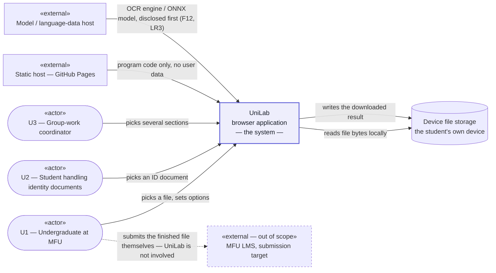
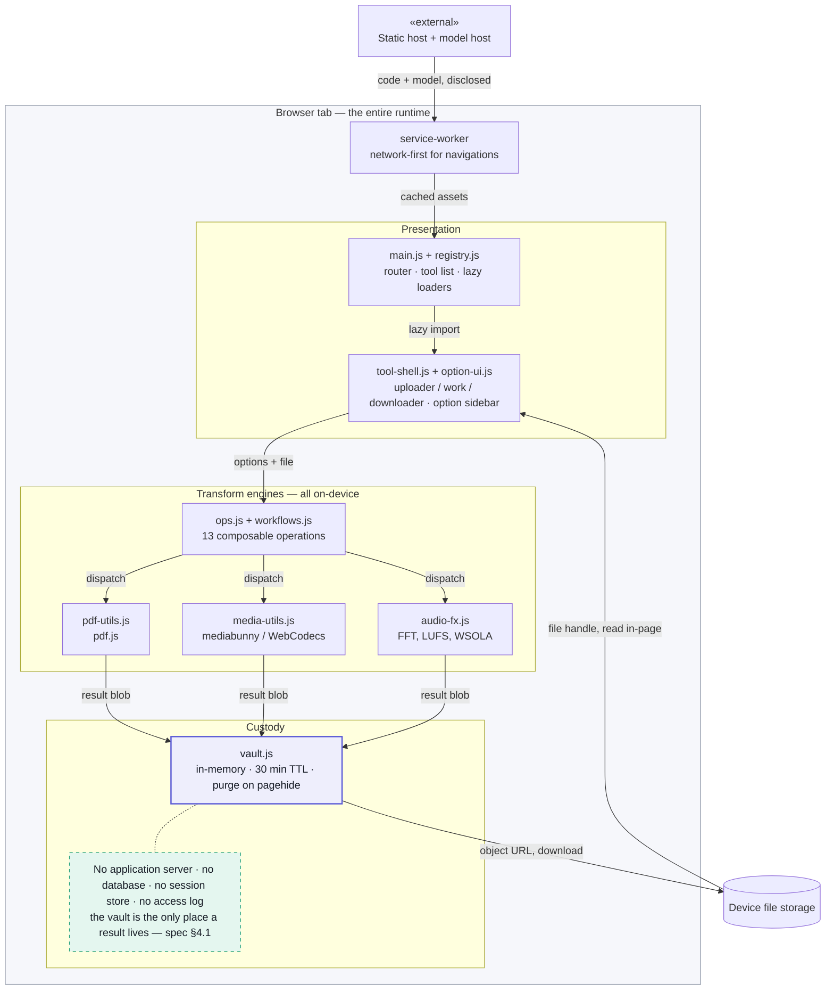

# Diagrams D1–D4 — UniLab

**Course:** 1305493 · W4 · 2 Sep 2026
**Source:** D1, D3 and D4 are Mermaid, rendered natively by GitHub. D2 is
[`d2-use-case.svg`](d2-use-case.svg) — hand-authored SVG, because Mermaid has no use-case
diagram type and cannot draw a UML actor. **Nothing here is a binary export:** every diagram is
plain text in this repository and diffs like code, so none of them can silently fall out of date
with the spec.
**Checked by:** [`.claude/agents/diagram-checker.md`](../../.claude/agents/diagram-checker.md)

Every actor name below appears in spec §1.1. Every step in D4 appears in
[`user-journey.md`](user-journey.md), in the same order. The architecture in D3 names only
components that exist in `src/`.

---

## D1 · System Context

The system as one box: who talks to it, and what crosses the boundary.

**What this diagram is claiming.** There is **no arrow carrying user file content out of the
box**. The only inbound arrows are program code and model data. Submission to the LMS is drawn
dashed and *outside* the system: the student does it themselves, from their own device, after
UniLab is finished. That absence is LR1, and it is why §4.1 of the spec can dissolve the CCA §26
logging duty — there is no event to log.

**Every node is typed**, so the boundary reads without the prose: `«actor»` ×3, `«external»`
×2, one data store, and the system itself as a single box with nothing drawn inside it.

**The LMS arrow starts at the student, not at the device.** It used to run
`Device file storage → MFU LMS`, which said a *data store* performs an upload. It does not — the
**student** does, from their own machine, after UniLab has finished. It is now a dashed arrow
from U1 marked *"UniLab is not involved"*, which is the honest boundary statement and the reason
the arrow is drawn at all.

**In scope:** the transform. **Out of scope:** submission, storage, accounts, delivery.

---

## D2 · Use Case

Who can do what. The core use case is central; every other use case is a specialisation of it.

> **Source:** [`d2-use-case.svg`](d2-use-case.svg) — hand-authored SVG, not a binary export. It is
> plain text, diffs like code, and every colour in it is a token from
> [`design-system.md`](design-system.md). It replaced a Mermaid `flowchart` on 7 Sep 2026:
> Mermaid has no use-case diagram type, so actors were drawn as rounded boxes and associations
> carried arrowheads. **Both are UML errors**, and the W4 deck grades the notation explicitly.

### The notation, and why each relationship is the one it is

| Relationship | Drawn as | Used here for |
|---|---|---|
| **Association** | plain solid line, **no arrowhead** | An actor uses a use case. U1 → compress / convert / OCR / delete · U2 → redact / delete · U3 → merge / batch workflow |
| **Generalization** | solid line, **hollow triangle** at the general case | The six tools are each *a kind of* "Transform a file on this device" |
| **«include»** | dashed line, **open arrowhead**, base → included | Behaviour that **always** runs |
| **«extend»** | dashed line, **open arrowhead**, extension → base | Behaviour that runs **only sometimes** |

**Generalization is doing the rubric's work.** The earlier version drew the six tools as
`«extend»` of the core, which was wrong twice over: `«extend»` means *optional, conditional*
behaviour at an extension point, and compressing a PDF is neither optional nor an addition to
transforming a file — **it is a transform**. Drawn as generalization, the diagram now states the
claim the rubric turns on: *58 tools are 58 settings of one workflow, not 58 workflows.*

**The two `«include»`s are the two things that are never skipped.**

- `Transform a file` **«include»** `Hold the result in the vault` — every transform puts its
  output in the vault. That is F6 and LR5, and there is no path that skips it.
- `OCR a scan` **«include»** `Disclose a network download` — OCR cannot run until a language
  pack is fetched, so the disclosure always precedes it. That is F12 and LR3.

**The one `«extend»` is the one thing that is genuinely optional.** `Delete the result now`
**«extend»** `Hold the result in the vault`: the student *may* press it, and if they never do,
the countdown expires the result anyway. Optional behaviour on a base use case is exactly what
`«extend»` is for — and it is the only place in this diagram that qualifies.

**Both U1 and U2 are drawn** although spec §1.1 says they are the same person at a different
moment, because the custody stakes differ: a lecture handout and a passport scan are not the
same risk, and only U2 reaches for redaction.

> **Two of the six tool use cases — `OCR a scan` and `Run a saved workflow` — are shipped
> capability whose *requirements* were parked on 8 Sep 2026** (F8, F11 — spec §2.1), because 0 of
> 15 interviewees raised the hypothesis behind either. They stay in the diagram: D2 describes what
> the product does and who can do it, not what the backlog promises. If Q5 / Q6 cut them, the two
> ovals and the OCR `«include»` go in the same change, and `diagram-checker` C1b is re-run.

---

## D3 · High-level Architecture

Three layers inside one browser tab, and the direction data moves between them. Matches the
stack named in the spec: Vite + vanilla JS, pdf.js, mediabunny/WebCodecs, ONNX Runtime Web,
Tesseract.

**Read it as three bands.** `Presentation` routes and frames · `Transform engines` do the work,
all on-device · `Custody` holds the one copy of a result. Modules that are always used together
are drawn as one component — `main.js + registry.js`, `tool-shell.js + option-ui.js` — because
the deck asks for *layers and components, not code*, and a box per file was the wrong altitude.

**Every arrow is labelled with what crosses it, and every arrow joins two components.** Two
edges used to point at the `ENGINE` *subgraph* rather than at a component inside it, which
renders as an arrow into a group boundary — ambiguous about which module is actually called. The
call path is now explicit: `tool-shell → ops → pdf-utils / media-utils / audio-fx → vault`.

**The tier that is not here is the design.** Every box sits inside one browser tab. There is no
API tier and no database tier, so there is nowhere for an `access_log` table or a `consent`
store to live — which is exactly why the duties in spec §4.1 dissolve rather than being
discharged. The one boundary crossing, `CDN → service worker`, carries program code and model
data only.

**Where the known defect lives:** the `CDN → service worker` precache is **31 MB**, 23 MB of it
the ONNX runtime for a single tool (D1 in the spec, B9). It is a defect of this architecture,
drawn here rather than hidden.

---

## D4 · Activity

One scenario, start to end: **compress a scanned PDF to the 5 MB cap** — the five steps of
[`user-journey.md`](user-journey.md), in order.

```mermaid
flowchart TB
    START(( ))
    S1["1. Open UniLab,<br/>tap Compress PDF"]
    S2["2. Pick the scanned PDF<br/>from the device"]
    READ["Read the file bytes in-page<br/>— no upload"]
    S3["3. Enter the target size<br/>— 5 MB"]
    EST["Render live preview +<br/>estimated output size"]
    CAP{"Is the estimate<br/>under 5 MB?"}
    S4["4. Student taps <b>Compress PDF</b><br/>→ pdf.js runs on-device,<br/>yielding every ~24 ms"]
    STORE["Store the result in the vault<br/>— 30:00 countdown starts"]
    S5["5. Download the result"]
    DISP{"Delete it now?"}
    DEL["Revoke the object URL,<br/>drop it from memory"]
    EXP["Purge on pagehide, or<br/>when the countdown ends"]
    FINAL(("●"))

    START --> S1 --> S2 --> READ --> S3 --> EST --> CAP
    CAP -- "[no]" --> S3
    CAP -- "[yes]" --> S4 --> STORE --> S5 --> DISP
    DISP -- "[yes]" --> DEL --> FINAL
    DISP -- "[no]" --> EXP --> FINAL

    style START fill:#171c26,stroke:#171c26
    style FINAL fill:#ffffff,stroke:#171c26,stroke-width:2.5px,color:#171c26,font-size:22px
```

### Every diamond is a decision

| Diamond | In | Out | Reads as |
|---|---|---|---|
| `Is the estimate under 5 MB?` | 1 | **2** | `[yes]` runs the compression · `[no]` returns to step 3 to change the target |
| `Delete it now?` | 1 | **2** | `[yes]` is the student pressing **Delete now** · `[no]` is the countdown ending or the tab closing |

**There are no merge diamonds, and that is deliberate.** Where two flows rejoin — at step 3 and
at the final node — the edges simply enter the node. UML treats **multiple incoming edges on a
node as an implicit merge**, so an explicit merge diamond adds a shape without adding meaning.

An earlier draft used explicit merge nodes and claimed they were *required* for the UML to be
legal. **That claim was wrong** and has been removed. The merge node is optional, and dropping it
is what lets a reader apply one rule instead of two: *a diamond asks a question and has two
guarded exits.* Bare diamonds that ask nothing were the original complaint against this diagram,
and they are now gone entirely.

**Notation.** The question sits **inside** the diamond, so each exit needs only `[yes]` or `[no]`
— short enough that Mermaid cannot draw the edge through its own label, which is what happened
when the guards carried the full condition. `●` is the UML initial node and `◉` the final node;
there is no labelled "Start"/"End" box anywhere.

### What the two decisions are there to prove

**The size decision loops backwards, and that is the whole point of F5.** `[no]` returns
straight to step 3, so the student changes the target and re-reads the estimate. They never spend
a run to discover the file is still too big.

**The disposal decision has no output that keeps the file.** `[yes]` revokes the object URL immediately;
`[no]` lets the countdown or `pagehide` purge it. Both edges lead to destruction, then to the
final node. That is F6 and LR5 drawn as a shape rather than asserted in prose — a reader can
check the claim by looking for an exit that keeps the result, and finding none.

---

## Consistency statement

| Must agree | D1 | D2 | D3 | D4 |
|---|---|---|---|---|
| Actors named exactly as spec §1.1 | ✅ U1, U2, U3 | ✅ U1, U2, U3 | — (no actors) | ✅ the student of U1 |
| No arrow carries user file content off-device | ✅ | ✅ | ✅ | ✅ (step 2 reads in-page) |
| Steps match `user-journey.md` order | — | ✅ core use case | — | ✅ 1–5 |
| Components exist in `src/` | — | — | ✅ | ✅ pdf.js, vault |
| Tech stack matches the spec | — | — | ✅ | ✅ |
| **UML notation is correct** | ✅ one box, actors outside | ✅ stick figures · ovals in the boundary · associations with no arrowhead · hollow-triangle generalization · dashed open-arrow stereotypes | ✅ layers, not code | ✅ ● initial / ◉ final · every diamond is a decision with two guarded exits · guards in `[brackets]` |

### Notation audit, 7 Sep 2026

Both diagrams the W4 deck grades on notation were rebuilt:

| Was wrong | Now |
|---|---|
| **D2 actors were rounded boxes.** Mermaid `flowchart` has no actor glyph, so U1–U3 rendered as stadium shapes — not UML | Stick figures, drawn in SVG |
| **D2 associations carried arrowheads** (`---` renders a line, but the tool-to-core links used `-.->`) | Associations are plain solid lines with **no arrowhead** |
| **D2 used `«extend»` six times** for the tools. `«extend»` means *optional, conditional* — but compressing a PDF *is* a transform, not an optional addition to one | **Generalization** (hollow triangle): each tool *is a kind of* the core use case. `«extend»` now appears once, where the behaviour really is optional |
| **D4 had a 1-in / 1-out diamond** (`merge_run`) — neither a decision nor a merge, and it read as an unanswered question | Removed |
| **D4 still drew merge diamonds** — bare diamonds that ask nothing, which is what made the original complaint right | Removed. Flows rejoin by entering the node directly, UML's implicit merge. **Every remaining diamond is a decision** |
| **D4's guards were long enough that Mermaid drew the edge through them** | Question moved *inside* the diamond; exits are just `[yes]` / `[no]` |
| **D1 drew the upload to the LMS as leaving the device storage** — a data store does not perform an upload | The dashed arrow now starts at **U1**, the actor who actually does it, labelled *UniLab is not involved* |
| **D1 externals were untyped** — nothing on the diagram said which box was an actor and which a third-party system | Every external carries `«actor»` or `«external»`; the out-of-scope LMS says so on its face |
| **D3 pointed two arrows at a subgraph** rather than at a component, so the call was ambiguous | `tool-shell → ops → pdf-utils / media-utils / audio-fx → vault`, component to component |
| **D3 had four unlabelled arrows** — the deck asks arrows to show what moves | Every arrow carries a label |
| **D3's "no server tier" note floated unattached**, stretching the canvas and clipping off the right edge | Anchored to `vault.js` with a dashed UML note line — the component the claim is actually about |
| **D3 was a 1418 × 1656 staircase** with a large dead region and a subgraph title clipped by a node | Recomposed as three labelled layer bands, 1250 × 1550, nothing clipped |
| **D3 boxed one file per node** — the deck asks for components, not code | Always-together modules merged into one component; `service-worker` lifted out of `Presentation`, where it never belonged |
| **D4 decisions had no yes/no** — guards described the condition but never answered it | Every decision asks its question on the inbound edge and answers `[yes]` / `[no]` on both outbound edges |

Verified mechanically, all four diagrams:

| Check | Result |
|---|---|
| Mermaid parses D1, D3, D4 | **3 of 3, 0 syntax errors** |
| All four rendered and inspected as images | ✅ headless Chrome (D1, D3, D4) · rsvg (D2) |
| D1 — system drawn as one box, no internals | ✅ |
| D1 — externals typed, ≥ 2 actors | ✅ 3 actors, 2 `«external»`, 1 data store |
| D3 — no arrow points at a subgraph | ✅ 0 |
| D3 — every arrow labelled | ✅ **12 of 12 data arrows.** The 13th edge, `VAULT -.- NOSRV`, is a note link, not a data flow, and carries no label by design |
| D4 — every diamond asks a question | ✅ **2 decisions** (1 in, 2 guarded out each) · **0 merge diamonds** — flows rejoin by entering the node, per the note above |
| D2 — notation counts | ✅ 3 stick figures · 8 associations · 6 generalizations · 2 `«include»` · 1 `«extend»` |
