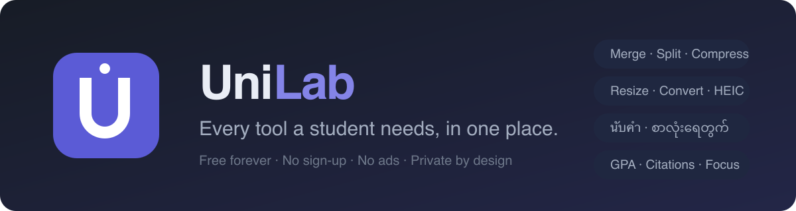

<p align="center">
  
</p>

<p align="center">
  <a href="https://mfu-hlaing.github.io/unilab/"><b>🎒 Open UniLab →</b></a>
</p>

<p align="center">
  <a href="https://github.com/mfu-hlaing/unilab/actions/workflows/deploy.yml"></a>
  <a href="LICENSE"></a>
  <a href="CONTRIBUTING.md"></a>
  
</p>

**UniLab** is a free, open-source toolbox for students — think iLovePDF /
iLoveIMG, but with one radical difference: **everything runs 100% inside your
browser.** No uploads, no accounts, no ads, no task limits, no file-size caps,
and your documents never touch a server. Once loaded, it even works offline as
an installable PWA.

Built by students at Mae Fah Luang University for **1305493 Software
Engineering Case Studies** (1/2569) — and for every student who has fought an
LMS upload cap at 11:55pm.

## Why client-side?

| | Upload-based sites | UniLab |
|---|---|---|
| Your transcript / ID scan | goes to their server | never leaves your device |
| Free tier | 2 tasks/day, size caps, ads, watermarks | everything, always |
| Slow campus Wi-Fi | upload + download round-trip | instant |
| Offline | ✗ | ✓ (PWA) |
| PDPA / privacy story | a policy you must trust | an architecture you can verify |

The trade-off, stated honestly: no server-grade conversions (PDF→Word needs a
server; we don't do it), and PDF compression rasterizes text. We think that's
the right trade for student daily life.

## The tools (58)

| Category | Tools |
| --- | --- |
| 🖼️ **Image** (13) | Compress (*"must be under X MB"* target mode) · Resize · Crop (ID-photo presets) · Convert · Images→PDF · **HEIC→JPG** · Add Text · Rotate · Watermark · **Remove Background** · **Blur Faces** · Enlarge (Lanczos-3) · Photo Editor |
| 🎬 **Video** (7) | Compress · Trim · Convert · Resize for 9:16/1:1/16:9 · Video→GIF · Video→Photos · Screen Recorder |
| 🎵 **Audio** (11) | **Enhance Voice** (one-press clean-up) · **Remove Noise** (spectral + optional on-device neural) · Fix Volume (LUFS) · Change Speed (pitch-preserved) · Cut Silences · Equalizer (live preview) · Join Audio · Extract Audio · Trim · Convert · Voice Recorder |
| 📄 **PDF** (20) | Merge (page ranges + contents page) · Split (named parts) · Compress (3 levels or a size cap) · Rotate · PDF→Images · Organize · Watermark · Page Numbers · **Sign** · Crop · **Edit** · **OCR (Thai + Burmese)** · Fill Form · Unlock · **Redact** · Compare · PDF→Markdown · Scan to PDF · Word→PDF · Excel→PDF |
| ✍️ **Text** (2) | Word Counter (Unicode-correct — see below) · Citation Generator (APA 7 / MLA 9) |
| 🎓 **Study** (2) | GPA Calculator (Thai university scale, saved on-device) · Pomodoro Focus Timer |
| 🧰 **Everyday** (3) | **Workflows** · QR Code Maker (link + Wi-Fi, never expires) · Unit Converter (incl. Thai land units ไร่/งาน/ตร.วา) |

### Workflows — chained tools, free

iLovePDF sells *Workflows* as a Premium feature, and it has to be paid for: every hop
in a chain costs them another upload, another store and another download. In a browser
the file is already in memory, so a chain is not only free — it is **faster** than
running the tools one at a time.

Pick your steps, save the chain, drop your files in. Ready-made ones cover the evenings
that actually happen: *photos of notes → one small numbered PDF*, *lecture video → a
64 kbps MP3*, *report → stamped DRAFT and numbered*.

### The audio lab

Adobe's Podcast Enhance does its cleaning on Adobe's servers. UniLab's audio lab does
real signal processing in the tab: spectral noise gating that learns the room from the
gaps between sentences, mains-hum notching, LUFS loudness normalisation, pitch-preserving
speed change, silence cutting that tells you how many minutes it saves — and an optional
**neural voice mode** running RNNoise as WebAssembly, bundled with the site (112 KB,
same-origin, works offline). Honest limits, stated in the tools themselves: steady
background noise comes out; a voice drowned by a passing truck does not come back.

### Video and audio, which no comparable site has

Neither iLovePDF nor iLoveIMG has a single video or audio tool. UniLab has eleven, built
on **WebCodecs** — the browser API that hands a page the same hardware decoder the video
player uses. That is how a 500 MB lecture recording gets trimmed in seconds without being
uploaded. We deliberately did *not* use `ffmpeg.wasm`: it would mean shipping ~31 MB of
WebAssembly and decoding on the CPU.

### Your files are never stored — and you can watch the clock

Finished files live in this tab's memory with a countdown on screen, and are dropped when
it runs out, when you close the tab, or when you press the bin. Upload-based sites show
you the same countdown; the difference is that theirs is a promise about a copy on their
servers, and ours is about the only copy there has ever been.

## Unicode done right 🇹🇭🇲🇲

Most counters get Southeast Asian scripts wrong. UniLab counts what you
actually see:

- Burmese **ရွဲ့** = **1 character** (not 4) — grapheme-cluster counting via
  `Intl.Segmenter`, with a separate *code points* stat for portals that count
  the raw way, and a combo inspector that shows the decomposition (ရ + ွ + ဲ + ့).
- Thai **สวัสดี** = 4 characters, and word counting works without spaces.
- Zero-width spaces (the invisible separators in Myanmar text) count as
  spaces; **။** and **។** count as sentence ends.
- 👨‍👩‍👧‍👦 = 1 character, like your eyes say.

## Run it locally

```bash
git clone https://github.com/mfu-hlaing/unilab.git
cd unilab
npm install
npm run dev
```

Vite + vanilla JavaScript — no framework to learn. Processing is done by
[pdf-lib](https://pdf-lib.js.org), [pdf.js](https://mozilla.github.io/pdf.js/),
[mediabunny](https://mediabunny.dev) (WebCodecs video/audio),
[tesseract.js](https://tesseract.projectnaptha.com) (OCR),
[mammoth](https://github.com/mwilliamson/mammoth.js) (.docx),
[browser-image-compression](https://github.com/Donaldcwl/browser-image-compression),
[cropperjs](https://fengyuanchen.github.io/cropperjs/),
[heic2any](https://github.com/alexcorvi/heic2any),
[gifenc](https://github.com/mattdesl/gifenc),
[jszip](https://stuk.github.io/jszip/) and
[qrcode](https://github.com/soldair/node-qrcode) — all in-browser.

Two tools download a model on first use — OCR fetches its language data, and Remove
Background fetches an ONNX model. Both are gated behind an explicit button that states
the size, and in both cases it is the *engine* that is downloaded: your file stays here.

## What we deliberately don't do

PDF→Word, PDF→PowerPoint, PDF→Excel, HTML→PDF, password *protection*, PDF/A and repair
all need a server, so they are not here. Neither is an AI summariser or translator: those
send your document to a model provider, which is the exact thing this project exists to
avoid. Compress PDF rasterises pages, so its output has no selectable text — the tool
says so on screen.

Deploys to GitHub Pages automatically on every push to `main`
([workflow](.github/workflows/deploy.yml)).

## Contributing

New tools, translations (Thai/Burmese UI is on the roadmap), bug reports and
first-time contributions are all welcome — a new tool is ~1 file plus a
registry entry. Start with **[CONTRIBUTING.md](CONTRIBUTING.md)**; the one
unbendable rule is that everything must run client-side.

## AI use disclosure

Prototype scaffolding and market research were AI-assisted (Claude), as
encouraged by the course's AI-first policy. All code is reviewed, tested in
the browser with real files, and owned by the team.

## License

[MIT](LICENSE) — free to use, learn from, and fork.
